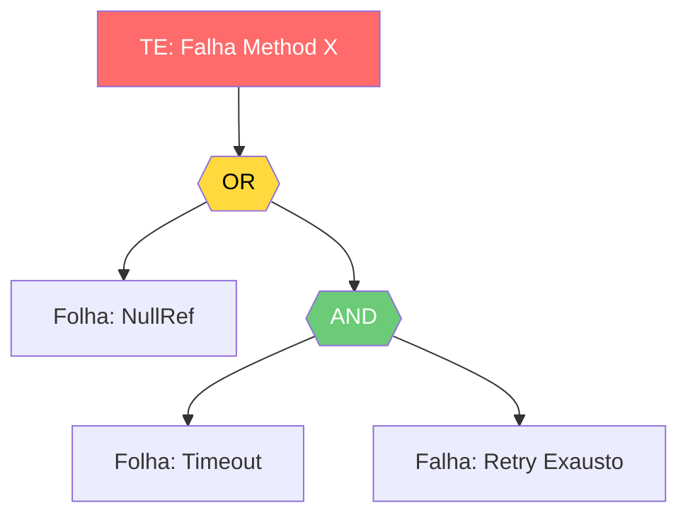
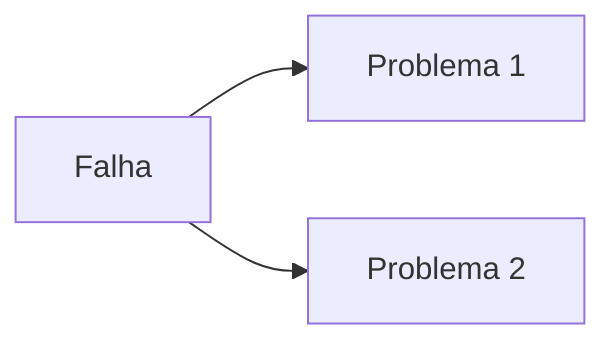
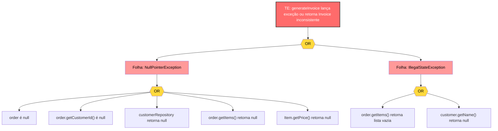

# FTA CODE LEVEL — Mapeamento de falhas do método ao artefato resiliente

> **Propósito**: Decompor funções/métodos em árvores de falhas determinísticas, mapeando cada caminho de erro para exceções concretas e gerando o artefato (Mermaid + Tabela) pronto para consumo ou geração de testes.

---

## Filosofia Central

1. **Contrato como Evento Topo** — O "Evento Topo" (TE) da árvore é sempre a quebra do contrato do método (retornou nulo inesperado, lançou exceção não tratada, mutou estado incorreto). Na prática: nunca use "Sistema caiu" como TE; use "Método `processPayment` retorna `Status.ERROR` inesperado".
2. **Exceção como Porta OR** — Toda cláusula `try/catch` ou propagação de erro no código se traduz em uma porta OR na árvore. Na prática: um bloco catch com 3 exceções gera 3 galhos OR distintos.
3. **Estado Degradado é Falha** — Nulls, coleções vazias inesperadas e stale state não são "casos edge", são eventos básicos (folhas) da árvore. Na prática: `if (user == null)` é uma mitigação de uma folha de falha, não um fluxo normal.
4. **Resiliência Obrigatória na Folha** — Toda folha (evento básico) da FTA deve ter uma contramedida de código associada (Guard Clause, Retry, Fallback, Circuit Breaker). Na prática: folha sem mitigação = bug categorizado como CRÍTICO no artefato.
5. **Artefato Determinístico** — A saída não é prosa, é um diagrama de porta lógicas renderizável e uma tabela de rastreabilidade Falha -> Código. Na prática: o output final não tem parágrafos de introdução, apenas o diagrama e a tabela.

---

## Quando Ativar

### ✅ Ativar para:
- Analisar resiliência de métodos críticos (pagamento, autenticação, escrita em BD).
- Mapear todas as exceções que um método pode lançar ou propagar.
- Criar documentação de falhas para auditoria de segurança ou confiabilidade.
- Gerar insumo para criação de testes de unidade baseados em falhas.

### ❌ NÃO ativar para:
- FTA de arquitetura de sistemas ou infraestrutura → use `system-architecture`.
- Escrever testes unitários (após a FTA) → use `unit-testing` com o output desta skill.
- Corrigir um bug simples de lógica → resolva diretamente.

---

## Escopo e Limites

**Cobre:**
- Métodos únicos ou funções puras em qualquer linguagem OO ou funcional.
- Tratamento de exceções, null-safety, validação de inputs e chamadas de dependências externas (APIs, BD, File System).
- Geração de diagramas Mermaid (lógica de portas) e Tabelas Markdown (Rastreabilidade).

**Delega:**
- Análise de threads/concorrência complexa (race conditions entre múltiplos métodos) → `concurrency-patterns`.
- Desenho de testes a partir das falhas mapeadas → `unit-testing`.

---

## Protocolo de Execução

1. **Extrair e Isolar** o código-alvo. Identifique Assinatura, Pré-condições, Pós-condições e Dependências (injeções, chamadas externas). *Critério de conclusão: Código delimitado e dependências listadas.*
2. **Definir o Evento Topo (TE)**. Formule como a quebra da pós-condição. *Critério de conclusão: TE definido no formato "Método [X] falha ao [Y]".*
3. **Decompor em Portas Lógicas**. Mapeie a estrutura de controle do código (IFs aninhados = ANDs, Try/Catches = ORs, early returns = ORs). *Critério de conclusão: Esqueleto da árvore desenhado refletindo o fluxo de controle.*
4. **Preencher Eventos Básicos (Folhas)**. Para cada porta, identifique o gatilho exato (ex: `NullPointerException`, `HttpTimeoutException`, `EmptyListException`). *Critério de conclusão: Todas as folhas terminam em exceções concretas ou estados inválidos.*
5. **Mapear Mitigações Existentes**. Analise o código fonte para verificar se a folha já possui mitigação (ex: `if (obj != null)`). *Critério de conclusão: Cada folha classificada como "Mitigada" ou "Sem Mitigação".*
6. **Prescrever Resiliência Ausente**. Para folhas sem mitigação, escreva o snippet de código da contramedida (Guard clause, try-catch específico, fallback). *Critério de conclusão: Snippets prontos para copiar/colar gerados para falhas críticas.*
7. **Compilar Artefato Final**. Renderize a árvore em sintaxe Mermaid (`graph TD` com nós customizados para portas AND/OR) e gere a Tabela de Rastreabilidade. *Critério de conclusão: Artefato Markdown validado, sem texto de transição.*

---

## Padrões Específicos

### Padrão 1: Definição do Evento Topo

**Regra**: O TE deve focar no erro do método, não no impacto no usuário.

```text
// ✅ PASS — Foco no contrato do método
TE: Método `calculateDiscount` lança exceção não tratada ou retorna valor negativo

// ❌ FAIL — Foco no impacto humano/sistema
TE: O usuário final não consegue ver o preço correto na tela de checkout
```

**Por que importa**: FTA de código deve ser verificável lendo o código. Impacto no usuário pertence a FTA de sistema.

### Padrão 2: Mapeamento de Controle de Fluxo para Portas

**Regra**: Early returns/Guard clauses são portas OR. Bloco sequencial obrigatório é porta AND.

```text
// ✅ PASS — Mapeamento fiel ao fluxo
[TE: Falha no processamento]
  ├── (OR) Entrada inválida
  │    ├── Folha: ID é nulo
  │    └── Folha: ID é vazio
  └── (OR) Falha de Execução
       ├── (AND) Falha de Rede E Falha de Retry
       │    ├── Folha: TimeoutException
       │    └── Folha: RetryExhaustedException
       └── Folha: JsonParseException

// ❌ FAIL — Portas sem correspondência com o código real
[TE: Falha]
  ├── (AND) Erro de banco E Erro de rede  ← Se no código é um try-catch só, deve ser OR
```

**Por que importa**: A árvore perde o valor diagnóstico se a topologia lógica não refletir a topologia do código.

### Padrão 3: Classificação de Folhas

**Regra**: Folhas devem nomear a Exceção da linguagem ou o Estado inválido exato. Nunca conceitos vagos.

```text
// ✅ PASS
- Folha: `java.net.SocketTimeoutException` (timeout > 30s)
- Folha: `user.address` é `null` pós-deserialização

// ❌ FAIL
- Folha: Problema de internet
- Folha: Dado errado
```

**Por que importa**: Permite rastreabilidade direta com ferramentas de APM (Datadog, Sentry) e geração automatizada de mocks nos testes.

### Padrão 4: Formato do Artefato de Saída (Mermaid)

**Regra**: Usar nós específicos para portas lógicas garantir legibilidade do diagrama.





**Por que importa**: O padrão visual é essencial para engenheiros lerem a árvore em velocidade durante code reviews.

---

## Anti-Padrões Críticos

| Anti-padrão | Consequência | Alternativa Correta |
| :--- | :--- | :--- |
| Misturar FTA de código com FTA de infra | Árvore gigante, impossível de rastrear no IDE | Restringir ao escopo do método. Delegar infra para skill de arquitetura. |
| Listar falhas sem portas lógicas (lista flat) | Perde a relação de causa e efeito (o que precisa acontecer junto?) | Sempre usar estrutura hierárquica com portas AND/OR. |
| Gerar o artefato em prosa descritiva | Baixa densidade, difícil de consumir em PRs | Output estrito: Diagrama Mermaid + Tabela Markdown. Zero prosa. |
| Ignorar "Happy Path" implícito | Foca só no erro, esquecendo que a falta de validação de sucesso também é falha | Verificar se o método garante o retorno do estado válido em todos os IFs. |

---

## Critérios de Qualidade

Antes de entregar, confirme:

- [ ] Frontmatter completo e triggers verificados.
- [ ] Evento Topo (TE) focado estritamente no contrato do método.
- [ ] Diagrama Mermaid com sintaxe válida e estilização de cores (Vermelho=TE, Amarelo=OR, Verde=AND).
- [ ] Todas as folhas terminam em Exceções de sistema ou Estados nulos/inválidos.
- [ ] Tabela de Rastreabilidade contendo colunas: `Falha (Folha)`, `Tipo`, `Mitigação Atual?`, `Snippet de Correção`.
- [ ] Nenhuma folha classificada como "Sem Mitigação" ficou sem um snippet de código de correção.
- [ ] Zero texto de transição ou explicação em prosa no bloco final de entrega.

---

## Referências Cruzadas

| Precisa de... | Use a skill... |
| :--- | :--- |
| Gerar testes unitários a partir desta FTA | `unit-testing` |
| Analisar falhas de concorrência (locks, race conditions) | `concurrency-patterns` |
| FTA de alto nível (múltiplos microsserviços) | `system-architecture` |
| Aplicar padrões de resiliência (Circuit Breaker) | `resilience-patterns` |

---

## Exemplo Completo (End-to-End)

**Input do Usuário:**
> "Roda um FTA code-level pra essa função:"
> ```java
> public Invoice generateInvoice(Order order) {
>     Customer customer = customerRepository.findById(order.getCustomerId());
>     BigDecimal total = order.getItems().stream()
>         .map(Item::getPrice)
>         .reduce(BigDecimal.ZERO, BigDecimal::add);
>     return new Invoice(customer.getName(), total);
> }
> ```

**Artefato Gerado (Output da Skill):**



### Tabela de Rastreabilidade e Resiliência

| ID | Evento Básico (Folha) | Tipo | Mitigado? | Snippet de Resiliência |
|:---|:---|:---|:---:|:---|
| NPE1 | `order` é null | Exceção | ❌ | `Objects.requireNonNull(order, "Order cannot be null");` |
| NPE2 | `order.getCustomerId()` é null | Exceção | ❌ | `if (order.getCustomerId() == null) throw new ValidationException("Missing customer");` |
| NPE3 | `customerRepository.findById()` retorna null | Estado | ❌ | `return customerRepository.findById(id).orElseThrow(() -> new NotFoundException("Customer"));` |
| NPE4 | `order.getItems()` retorna null | Exceção | ❌ | `List<Item> items = Optional.ofNullable(order.getItems()).orElse(Collections.emptyList());` |
| NPE5 | `Item.getPrice()` retorna null na soma | Exceção | ❌ | `.map(i -> i.getPrice() != null ? i.getPrice() : BigDecimal.ZERO)` |
| ST1 | `getItems()` retorna lista vazia | Estado | ❌ | `if (items.isEmpty()) throw new BusinessException("Cannot invoice empty order");` *(Depende da regra de negócio)* |
| ST2 | `customer.getName()` retorna null | Estado | ❌ | `new Invoice(Optional.ofNullable(customer.getName()).orElse("N/A"), total);` |