# Project Workflow

## Operational Flowchart

```mermaid
graph TD
    %% Estilos
    classDef fase fill:#e3f2fd,stroke:#1e88e5,stroke-width:2px;
    classDef redPhase fill:#ffebee,stroke:#e53935,stroke-width:2px;
    classDef greenPhase fill:#e8f5e9,stroke:#43a047,stroke-width:2px;
    classDef decision fill:#fff3e0,stroke:#fb8c00,stroke-width:2px;

    Start([Início]) --> T1

    subgraph "Standard Task Workflow"
        T1[1. Selecionar Tarefa no plan.md] --> T2["2. Marcar em Progresso '[~]'"]
        T2 --> T3[3. Escrever Testes Falhos]:::redPhase
        T3 --> T4[4. Implementar Código para Passar]:::greenPhase
        T4 --> T5[5. Refatorar Código - Opcional]
        
        T5 --> T6{6. Cobertura > 80%?}:::decision
        T6 -- Não --> T3
        T6 -- Sim --> T7{7. Desvio da Tech Stack?}:::decision
        
        T7 -- Sim --> T7a[Parar e Documentar em tech-stack.md] --> T8
        T7 -- Não --> T8[8. Commitar Alterações de Código]
        
        T8 --> T9[9. Anexar Resumo da Tarefa via 'git notes']
        T9 --> T10["10. Registrar SHA no plan.md '[x]'"]
        T10 --> T11[11. Commitar Atualização do plan.md]
    end

    T11 --> Cond{A Tarefa conclui uma Fase?}:::decision

    Cond -- Não --> Fim([Ir para a Próxima Tarefa])
    
    Cond -- Sim --> P1

    subgraph "Phase Completion Verification & Checkpointing"
        P1[1. Anunciar Início do Protocolo]:::fase --> P2[2. Garantir Testes p/ todos os arquivos da Fase]:::fase
        P2 --> P3[3. Executar Testes Automatizados com Debug]:::fase
        P3 --> P4[4. Propor Plano de Verificação Manual detalhado]:::fase
        
        P4 --> P5{5. Feedback e Aprovação do Usuário?}:::decision
        P5 -- Não aprovou / Falhou --> P4a[Revisar Código/Plano] --> P3
        P5 -- Aprovou --> P6[6. Criar Commit de Checkpoint]:::fase
        
        P6 --> P7[7. Anexar Relatório de Verificação via 'git notes']:::fase
        P7 --> P8[8. Registrar SHA do Checkpoint no plan.md]:::fase
        P8 --> P9[9. Commitar Atualização do plan.md]:::fase
        P9 --> P10([10. Anunciar Conclusão da Fase])
    end

    P10 --> TrackCond{A Fase conclui a Track?}:::decision
    TrackCond -- Não --> Fim
    TrackCond -- Sim --> S1

    subgraph "Track Completion & Sync (Protocol 4.0)"
        S1[1. Analisar spec.md vs Docs do Projeto]:::fase --> S2[2. Identificar Novas Funcionalidades e Mudanças]:::fase
        S2 --> S3[3. Propor Diffs para product.md e tech-stack.md]:::fase
        S3 --> S4{4. Aprovação dos Diffs?}:::decision
        S4 -- Sim --> S5[5. Aplicar Mudanças nos Docs Principais]:::fase
        S4 -- Não --> S6[Ajustar Proposta] --> S3
        S5 --> S7[6. Registrar Conclusão na index.md]:::fase
    end

    S7 --> C1

    subgraph "Track Cleanup (Protocol 5.0)"
        C1[1. Solicitar Decisão de Arquivamento]:::fase --> C2{2. Decisão: Arquivar / Deletar / Manter?}:::decision
        C2 -- Arquivar --> C3[Mover para conductor/archive/]:::fase
        C2 -- Deletar --> C4[Remover pasta da Track]:::fase
        C2 -- Manter --> C5[Fim]
    end
```



## Guiding Principles

1. **The Plan is the Source of Truth:** All work must be tracked in `plan.md`
2. **The Tech Stack is Deliberate:** Changes to the tech stack must be documented in `tech-stack.md` _before_ implementation
3. **Test-Driven Development:** Write unit tests before implementing functionality
4. **High Code Coverage:** Aim for >80% code coverage for all modules
5. **User Experience First:** Every decision should prioritize user experience
6. **Non-Interactive & CI-Aware:** Prefer non-interactive commands. Use `CI=true` for watch-mode tools (tests, linters) to ensure single execution.
7. **Alignment with Operational Flowchart:** All operations must strictly follow the sequential logic defined in the project's operational flowchart.

## Track Management

All development work is organized into **Tracks**.

### Track Structure
Each track must reside in `conductor/tracks/<track-id>/` and contain:
1. `index.md`: Track overview and links.
2. `spec.md`: Specification and goals (use `.agents/templates/spec.md`).
3. `plan.md`: Implementation phases and tasks (use `.agents/templates/plan.md`).

### Track Lifecycle
1. **Creation**: Use `/newTrack` to initialize the directory and documents. **Nota:** O agente deve usar as sugestões de Skills do comando para preencher as seções de Mindset no `spec.md` e `plan.md`.
2. **Implementation**: Use `/implement` to follow the plan and TDD protocol.
3. **Archiving**: Once complete, move the track directory to `conductor/archive/` and update `conductor/index.md`.

### State Management & Stability Guidelines
- **File Validation**: Always verify the existence and readability of `plan.md`, `spec.md`, and `index.md` before attempting to modify them. If any critical file is missing or malformed, **abort** the current operation and ask the user for guidance.
- **Strict Parsing**: When parsing `plan.md` or `index.md` for statuses (e.g., `[ ]`, `[~]`, `[x]`), use strict pattern matching tightly scoped to the start of the line or specific table columns to prevent accidental modifications to unrelated text.
- **Git Environment & Resilience**: 
    - **Ghost Commits**: The `/revert` command uses autonomous discovery to find work even if the SHA was lost during a rebase.
    - **Reconciliation**: Reverts are high-fidelity, identifying both code and plan-update commits for a shared rollback.
    - **Smart Review**: The `/review` command automatically triggers **Iterative Mode** for changes > 300 lines to ensure Principal Engineer precision.
- **Graceful Degradation**: If `git` commands fail (e.g., "not a git repository"), gracefully degrade the workflow: skip attaching `git notes`, skip `git diff` steps, and append a pseudo-sha like `[no-git]` instead of failing the workflow entirely.

## Skills Integration

**Skills** are specialized cognitive frameworks that amplify the AI's execution in a specific domain. While Workflows dictate *how* the project moves forward, Skills dictate the *depth and mindset* of the execution.

- **Equipping a Skill**: To invoke a skill, a task in `plan.md` can be annotated with the skill's trigger (e.g., `<skill: ui-engineer>`).
- **Autonomous Management & Injection**: The Conductor is responsible for the entire artifact lifecycle. During the creation of `plan.md` or `spec.md`, the agent must analyze the task domain and proactively inject relevant skill triggers (e.g., `<skill: ui-architect>`). The user's role is to review these triggers, not to manually insert them.
- **Skill Repository**: All officially recognized skills reside in `conductor/skills/`.
- **Active Context**: When executing a task with a designated skill, the agent must read the skill's manifest file and rigidly follow its core directives to ensure a premium output.

## Task Workflow

All tasks follow a strict lifecycle:

### Standard Task Workflow

1. **Select Task:** Choose the next available task from `plan.md` in sequential order

2. **Mark In Progress:** Before beginning work, edit `plan.md` and change the task from `[ ]` to `[~]`

3. **Write Failing Tests (Red Phase):**
   - Create a new test file for the feature or bug fix.
   - Write one or more unit tests that clearly define the expected behavior and acceptance criteria for the task.
   - **CRITICAL:** Run the tests and confirm that they fail as expected. This is the "Red" phase of TDD. Do not proceed until you have failing tests.

4. **Implement to Pass Tests (Green Phase):**
   - Write the minimum amount of application code necessary to make the failing tests pass.
   - Run the test suite again and confirm that all tests now pass. This is the "Green" phase.

5. **Refactor (Optional but Recommended):**
   - With the safety of passing tests, refactor the implementation code and the test code to improve clarity, remove duplication, and enhance performance without changing the external behavior.
   - Rerun tests to ensure they still pass after refactoring.

6. **Verify Coverage:** Run coverage reports using the project's chosen tools. For example, in a Python project, this might look like:

   ```bash
   pytest --cov=app --cov-report=html
   ```

   Target: >80% coverage for new code. The specific tools and commands will vary by language and framework.
   **LOOP BACK:** If coverage is < 80%, you **must** return to **Step 3 (Write Failing Tests)** to increase test surface area.

7. **Document Deviations:** If implementation differs from tech stack:
   - **STOP** implementation
   - Update `tech-stack.md` with new design
   - Add dated note explaining the change
   - Resume implementation

8. **Commit Code Changes:**
   - Stage all code changes related to the task.
   - Propose a clear, concise commit message e.g, `feat(ui): Create basic HTML structure for calculator`.
   - Perform the commit.

9. **Attach Task Summary with Git Notes (If applicable):**
   - **Step 9.1: Check Git:** Verify if the project is a git repository (`git status`). If it is not, skip to Step 10 and use `[no-git]` as the hash.
   - **Step 9.2: Get Commit Hash:** Obtain the hash of the _just-completed commit_ (`git log -1 --format="%H"`).
   - **Step 9.3: Draft Note Content:** Create a detailed summary for the completed task.
   - **Step 9.4: Attach Note:** Use the `git notes` command to attach the summary to the commit.
     ```bash
     # The note content from the previous step is passed via the -m flag.
     git notes add -m "<note content>" <commit_hash>
     ```

10. **Get and Record Task Commit SHA:**
    - **Step 10.1: Update Plan:** Read `plan.md`, explicitly match the line starting with `- [~]` for the completed task. Update its status to `- [x]`, and append the first 7 characters of the _just-completed commit's_ commit hash (or `[no-git]`).
    - **Step 10.2: Write Plan:** Write the updated content back to `plan.md`.

11. **Commit Plan Update:**
    - **Action:** Stage the modified `plan.md` file.
    - **Action:** Commit this change with a descriptive message (e.g., `conductor(plan): Mark task 'Create user model' as complete`).

### Phase Completion Verification and Checkpointing Protocol

**Trigger:** This protocol is executed immediately after a task is completed that also concludes a phase in `plan.md`.

1.  **Announce Protocol Start:** Inform the user that the phase is complete and the verification and checkpointing protocol has begun.

2.  **Ensure Test Coverage for Phase Changes:**
    - **Step 2.1: Determine Phase Scope:** To identify the files changed in this phase, find the starting point. Read `plan.md` to find the Git commit SHA of the _previous_ phase's checkpoint. If no previous checkpoint exists or git is not available, the scope is all changes since the first commit (or all files in the current track context).
    - **Step 2.2: List Changed Files:** If git is available, execute `git diff --name-only <previous_checkpoint_sha> HEAD` to get a precise list of all files modified during this phase. If git is not available, review manually derived list of changed files.
    - **Step 2.3: Verify and Create Tests:** For each file in the list:
      - **CRITICAL:** First, check its extension. Exclude non-code files.
      - For each remaining code file, verify a corresponding test file exists.
      - If a test file is missing, you **must** create one. Before writing the test, analyze other test files to determine correct naming convention and testing style. The new tests **must** validate functionality described in this phase's tasks.

3.  **Execute Automated Tests with Proactive Debugging:**
    - Before execution, you **must** announce the exact shell command you will use to run the tests.
    - **Example Announcement:** "I will now run the automated test suite to verify the phase. **Command:** `CI=true npm test`"
    - Execute the announced command.
    - If tests fail, you **must** inform the user and begin debugging. You may attempt to propose a fix a **maximum of two times**. If the tests still fail after your second proposed fix, you **must stop**, report the persistent failure, and ask the user for guidance.

4.  **Propose a Detailed, Actionable Manual Verification Plan:**
    - **CRITICAL:** To generate the plan, first analyze `product.md`, `product-guidelines.md`, and `plan.md` to determine the user-facing goals of the completed phase.
    - You **must** generate a step-by-step plan that walks the user through the verification process, including any necessary commands and specific, expected outcomes.
    - The plan you present to the user **must** follow this format:

      **For a Frontend Change:**

      ```
      The automated tests have passed. For manual verification, please follow these steps:

      **Manual Verification Steps:**
      1.  **Start the development server with the command:** `npm run dev`
      2.  **Open your browser to:** `http://localhost:3000`
      3.  **Confirm that you see:** The new user profile page, with the user's name and email displayed correctly.
      ```

      **For a Backend Change:**

      ```
      The automated tests have passed. For manual verification, please follow these steps:

      **Manual Verification Steps:**
      1.  **Ensure the server is running.**
      2.  **Execute the following command in your terminal:** `curl -X POST http://localhost:8080/api/v1/users -d '{"name": "test"}'`
      3.  **Confirm that you receive:** A JSON response with a status of `201 Created`.
      ```

5.  **Await Explicit User Feedback:**
    - After presenting the detailed plan, ask the user for confirmation: "**Does this meet your expectations? Please confirm with yes or provide feedback on what needs to be changed.**"
    - **PAUSE** and await the user's response. Do not proceed without an explicit yes or confirmation.
    - **LOOP BACK:** If the user does not approve or provides feedback on failures, you **must** return to **Step 4 (Propose Manual Verification Plan)** or even **Step 3 (Execute Tests)** if code changes are required.

6.  **Create Checkpoint Commit:**
    - Stage all changes. If no changes occurred in this step, proceed with an empty commit.
    - Perform the commit with a clear and concise message (e.g., `conductor(checkpoint): Checkpoint end of Phase X`).

7.  **Attach Auditable Verification Report using Git Notes:**
    - **Step 7.1: Draft Note Content:** Create a detailed verification report including the automated test command, the manual verification steps, and the user's confirmation.
    - **Step 7.2: Attach Note:** Use the `git notes` command and the full commit hash from the previous step to attach the full report to the checkpoint commit.

8.  **Get and Record Phase Checkpoint SHA:**
    - **Step 8.1: Get Commit Hash:** Obtain the hash of the _just-created checkpoint commit_ (`git log -1 --format="%H"`).
    - **Step 8.2: Update Plan:** Read `plan.md`, find the heading for the completed phase, and append the first 7 characters of the commit hash in the format `[checkpoint: <sha>]`.
    - **Step 8.3: Write Plan:** Write the updated content back to `plan.md`.

9.  **Commit Plan Update:**
    - **Action:** Stage the modified `plan.md` file.
    - **Action:** Commit this change with a descriptive message following the format `conductor(plan): Mark phase '<PHASE NAME>' as complete`.

10. **Announce Completion:** Inform the user that the phase is complete and the checkpoint has been created, with the detailed verification report attached as a git note.

### Track Completion & Synchronization Protocol (Protocol 4.0)

**Trigger:** Executado quando a última tarefa de um `plan.md` é marcada como concluída.

1.  **Analyze Specification vs. Project Documents:**
    - O agente deve ler o `spec.md` da trilha concluída.
    - Comparar com `product.md`, `tech-stack.md` e `product-guidelines.md`.

2.  **Identify "Graduable" Content:**
    - Identificar funcionalidades implementadas que agora fazem parte da definição estável do produto.
    - Identificar novas tecnologias ou padrões adotados que devem constar no tech-stack global.

3.  **Propose Documentation Diffs:**
    - O agente deve apresentar uma proposta de alteração (diff) para cada documento afetado.
    - **CRITICAL:** Não aplicar as mudanças sem aprovação explícita do usuário.

4.  **Execute Synchronization:**
    - Após o "De acordo" do usuário, aplicar os diffs e commitar as atualizações na documentação do projeto.

### Track Cleanup Protocol (Protocol 5.0)

**Trigger:** Executado imediatamente após a sincronização da documentação (Protocolo 4.0).

1.  **Archive:** (Padrão) Move a pasta da trilha para `conductor/archive/` para manter o histórico audietável.
2.  **Delete:** Remove permanentemente a pasta se as mudanças forem triviais ou puramente experimentais.
3.  **Keep:** Mantém na lista ativa se houver planos imediatos de expansão na mesma trilha (não recomendado).

O agente deve atualizar o `conductor/index.md` movendo a entrada da trilha para a seção "Completed Tracks" e registrando a data de conclusão.

### Quality Gates

Before marking any task complete, verify:

- [ ] All tests pass
- [ ] Code coverage meets requirements (>80%)
- [ ] Code follows project's code style guidelines (as defined in `conductor/styleguides/`)
- [ ] All public functions/methods are documented (e.g., docstrings, JSDoc, GoDoc)
- [ ] Type safety is enforced (e.g., type hints, TypeScript types, Go types)
- [ ] No linting or static analysis errors (using the project's configured tools)
- [ ] Works correctly on mobile (if applicable)
- [ ] Documentation updated if needed
- [ ] No security vulnerabilities introduced

## Tooling & Commands

The AI agent must autonomously determine the tech stack by reading standard project manifests (e.g., `package.json`, `go.mod`, etc.) or referencing `tech-stack.md`. Development commands, testing setup scripts, and linting rules are dynamically inferred from these contextual files rather than being redundantly hardcoded in this workflow orchestration document.

## Commit Guidelines

### Message Format

```
<type>(<scope>): <description>

[optional body]

[optional footer]
```

### Types

- `feat`: New feature
- `fix`: Bug fix
- `docs`: Documentation only
- `style`: Formatting, missing semicolons, etc.
- `refactor`: Code change that neither fixes a bug nor adds a feature
- `test`: Adding missing tests
- `chore`: Maintenance tasks

### Examples

```bash
git commit -m "feat(auth): Add remember me functionality"
git commit -m "fix(posts): Correct excerpt generation for short posts"
```

## Definition of Done

A task is inherently complete when the **Checkpointing Protocol** passes seamlessly and all **Quality Gates** criteria are met. Emergency hotfixes may temporarily bypass strict track lifecycle constraints if production is down, but they must be retroactively synced into a formal track.